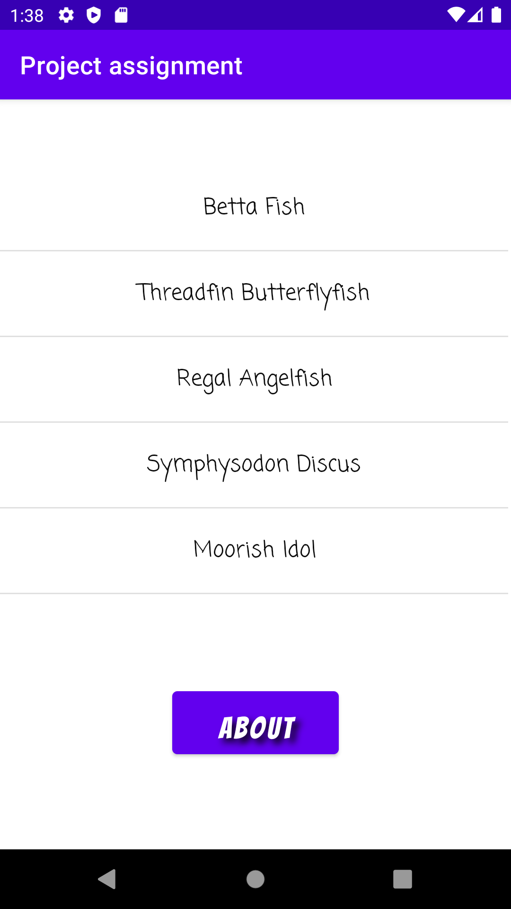
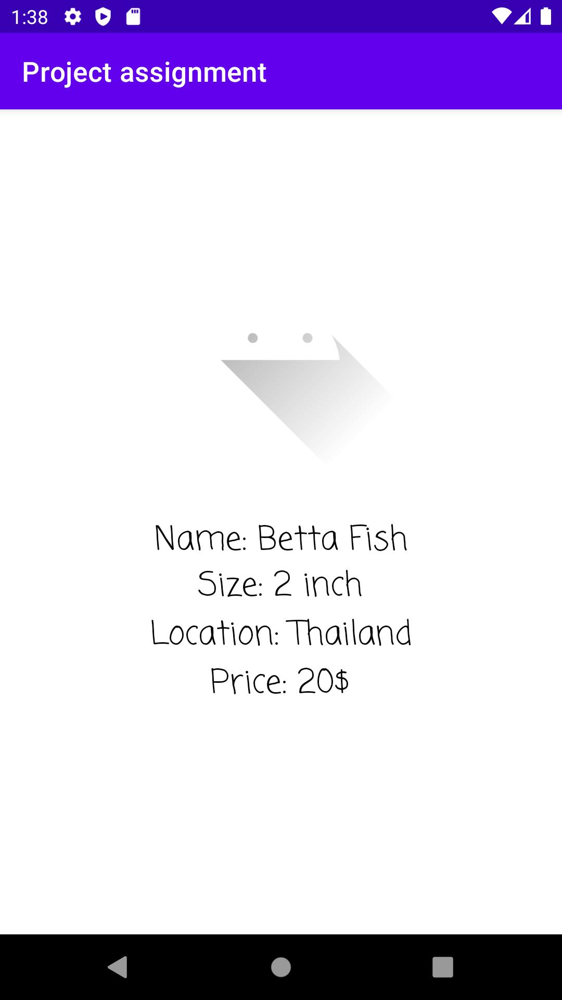
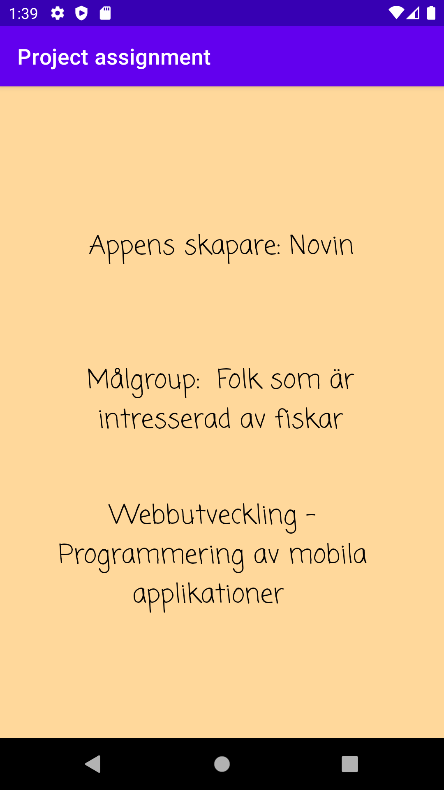

#   Project assignment

**Rapport**
I Dugga sidan står en del krav för att få godkänt på projektet, och jag listade ut de. Min kunskap från förra duggor hjälpte mig väldigt mycket. Jag började med att skapa en tom aktivitet. Första som jag gjorde var att lägga up min projekt på Github. Som vi gjorde i första duggor jag kopierade ett par kodrader som finns på Lenasys som gör zip fil från min archive av min lokal repository. Min app borde hämta data från internet därför jag gav det tillgång till internet, vilken man gör i manifest filen.
```
    <uses-permission android:name="android.permission.INTERNET" />
```

Jag la till en ListView I activity_main.xml, sen skapade jag en ny layout file med TextView för att kunna vissa mina fiskars namn på main activity screen. Sen jag skapade ett nytt activity som heter Fishes, och deklarerade några privat variabler som skulle få sin värde från länken som innehöll Json data. Själva Json filen skapades i Admin interface for Json data(Lenasys). I MainActivity.java jag deklarerade en ArrayList och en ArrayAdapter globalt. Anledningen till varför jag använde ArrayList och inte Array är ArrayList är smidigare och det är lättare att lägga till data i det. ArrayAdapter behövdes för att kunna visa information på ListView. Delar som skulle hantera networking kopierade jag från sista duggan som fick vi från Daniel. På onCreate functioned jag har referat vad Adapter pekar på och satt adaptern på ListView.
```
 item = new ArrayList<>();
 adapter = new ArrayAdapter<Fishes>(this,           R.layout.list_item_textview,R.id.list_item_textview,item);
        ListView my_listview = findViewById(R.id.my_list_view);
        my_listview.setAdapter(adapter);
        my_listview.setOnItemClickListener(new AdapterView.OnItemClickListener() {
            @Override
            public void onItemClick(AdapterView<?> parent, View view, int position, long id) {
            }
        });
```
Parsning av Json filen sker i onPostExecute funktionen. Först skapade jag en JsonArray från json datan som jag hade fått från länken.
```
        new JsonTask().execute("https://wwwlab.iit.his.se/brom/kurser/mobilprog/dbservice/admin/getdataasjson.php?type=a20novra");

```
Anledning till det var att kunna loopa(For loop) genom JsonArray. In i for loop jag skapade först en objekt från min jsonarray, för att ha tillgång till informationen och kunna tilldela den till variabler som jag skrev efter. Sen jag har lagt till de i min ArrayList med hjälp av add() funktionen.
```
 // Ditt JSON-objekt som Javaª
                JSONArray jsonarray = new JSONArray(json);
                for(int i = 0; i < jsonarray.length(); i++){
                    JSONObject object = jsonarray.getJSONObject(i);

                    String id = object.getString("ID");
                    String name = object.getString("name");
                    String size = object.getString("size");
                    String cost = object.getString("cost");
                    String location = object.getString("location");
                    String auxdata = object.getString("auxdata");

                    item.add(new Fishes(id,name, size, cost, location, auxdata));
                    adapter.notifyDataSetChanged();
```

På nästa steg skapade jag en tom activity. Min nya activity heter information som innehåller några TextView. För att kunna gå från main activity till information activity jag borde använda Intent. Så jag skapade en Intent när någon klickade på någon fisk namn. Med hjälp av put.Extras funktion jag skickade lite data till information activity.
```
  public void onItemClick(AdapterView<?> parent, View view, int position, long id) {
                Intent i = new Intent(MainActivity.this, Information.class);
                i.putExtra("name",     item.get(position).getName("name"));
                i.putExtra("size",     item.get(position).getSize("size"));
                i.putExtra("cost",     item.get(position).getCost("cost"));
                i.putExtra("location", item.get(position).getLocation("location"));
                i.putExtra("auxdata",  item.get(position).getAuxdata("auxdata"));
                startActivity(i);
            }
```

Sen I information activity jag fick datan I form av Bundle. Med hjälp av en if sats jag kontrollerar om bundle var inte lika med null, då vissa saker måste ske. Jag deklarerade några variabler här och tilldelade de med informationen som vi fick från Main activity. Jag hade lagt till några TextView i min actvity_information.xml, så jag refererade de till några variabler. Med hjälp av setText() funktionen jag visar datan på screen.
```
 Bundle bundle = getIntent().getExtras();
        if(bundle != null){
            String name     = bundle.getString("name");
            String size     = bundle.getString("size");
            String cost     = bundle.getString("cost");
            String location = bundle.getString("location");

            TextView textViewName = findViewById(R.id.name);
            TextView textViewSize = findViewById(R.id.size);
            TextView textViewCost = findViewById(R.id.cost);
            TextView textViewLocation = findViewById(R.id.location);

            textViewName.setText("Name: " + name);
            textViewSize.setText("Size: " + size + " inch");
            textViewCost.setText("Price: " + cost + "$");
            textViewLocation.setText("Location: " + location);
        }
```

Jag skapade en button för att visa lite information om appen. På samma sätt jag gjorde ett nytt activity som heter about. Sen jag lade en setOnClickListene() för att fånga användarens klick. Sen skapade jag en Intent för att kunna få till about aktivitet, men jag skickar inget data med den. I About aktivitet jag skapade några TextView och skrev manuellt, vem har gjort appen och vilka är målgruppen.

Jag stylade också min app med hjälp av margin, padding, background color(bara about screen), font-family osv.


;
;
;
